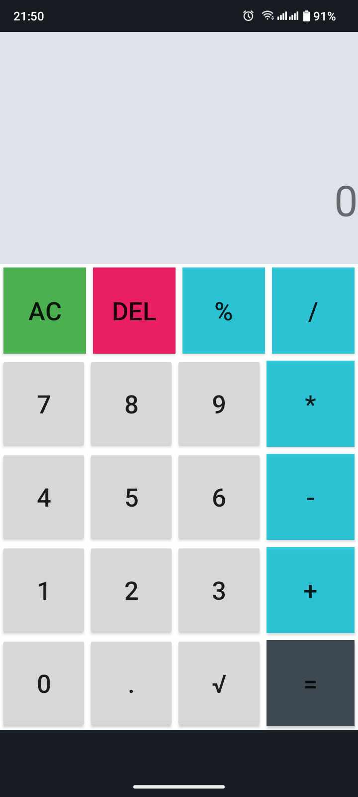

# 📱 FXCalculator - Android Calculator App

FXCalculator is a sleek, intuitive calculator app for Android built using Java and Android Studio. 🎨 Designed with a user-friendly interface, this app handles basic arithmetic operations efficiently! 🧮

## ✨ Features:

- Simple and clean UI for easy navigation 🧑‍💻
- Supports operations like addition ➕, subtraction ➖, multiplication ✖️, and division ➗
- Instant display of calculations on-screen 🔢
- Dynamic updates using modern Android development techniques 📲

## 🚀 Tech Stack:

- Java for core functionality
- XML for UI design
- Android Studio as the development environment

Get ready to calculate on the go! 🚀
